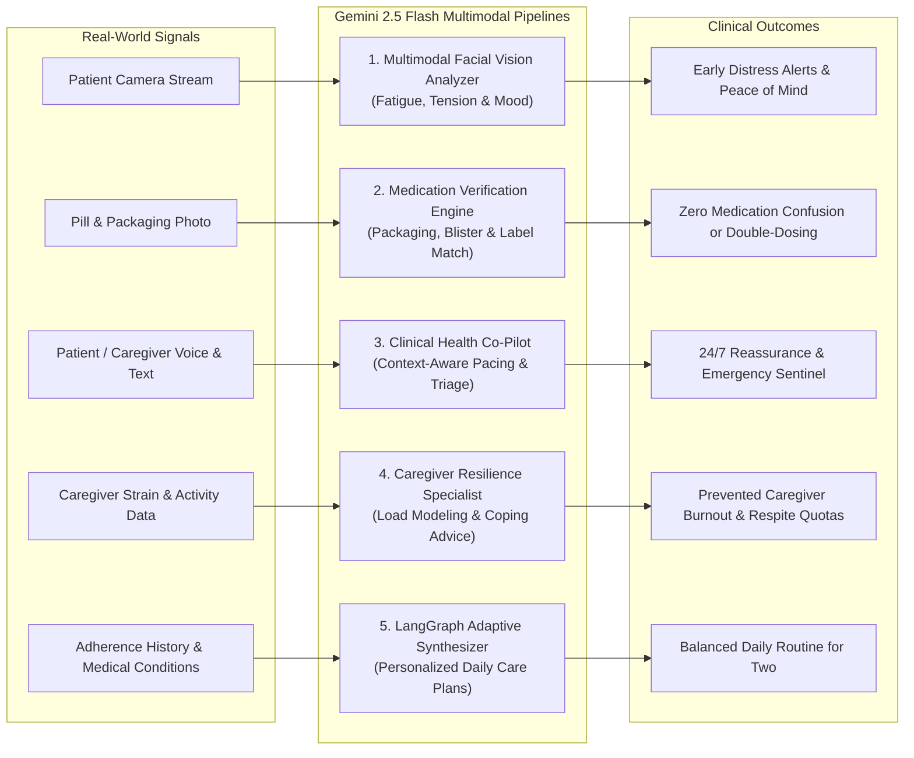
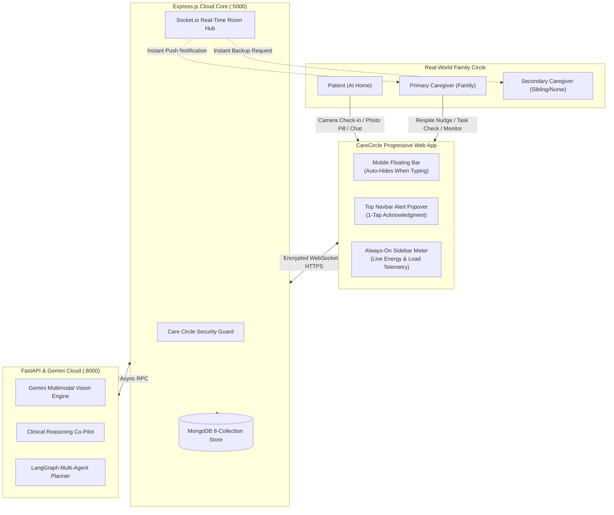
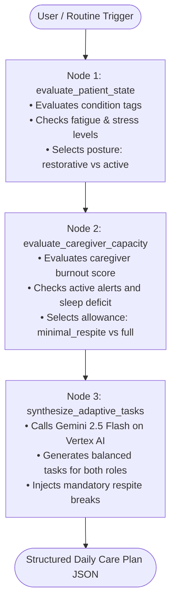

# CareCircle AI — "One Adaptive Team"

> **An intelligent, multimodal healthcare platform synchronizing Patients, Caregivers, and AI into one collaborative care network.**

[](https://react.dev/)
[](https://fastapi.tiangolo.com/)
[](https://expressjs.com/)
[](https://www.mongodb.com/)
[](https://cloud.google.com/vertex-ai)
[](https://langchain-ai.github.io/langgraph/)
[](https://socket.io/)
[](https://tailwindcss.com/)
[](LICENSE)

---

## 1. Real-World Healthcare Mission: The Problem We Solve

In modern outpatient and home healthcare, **care is fragmented, unmonitored, and emotionally exhausting**:
- **Patients** feel isolated, anxious, and guilty for burdening loved ones. They struggle to maintain rigid medication regimens, remember physical therapy exercises, and recognize subtle symptoms before they escalate into emergencies.
- **Family Caregivers** (over 53 million unpaid in the US alone) bear an overwhelming, invisible burden. Balancing full-time careers while managing medications, doctor appointments, and late-night emergencies leads to severe sleep deprivation, chronic anxiety, and depression.
- **The Healthcare Domino Effect**: When a family caregiver collapses from burnout, the patient is almost immediately readmitted to the hospital or placed into long-term institutional care.

**CareCircle AI redefines home healthcare through one central principle: "One Adaptive Team."**  
Instead of treating the patient as an isolated tracker and the caregiver as an unpaid helper, the platform establishes a closed-loop, empathetic ecosystem where:
- Every health action is transparently shared across the care circle in real time.
- Care schedules adapt dynamically to the patient's daily physical stamina and the caregiver's mental endurance.
- Artificial Intelligence acts not as a cold diagnostic tool, but as a supportive 24/7 digital care companion watching for fatigue, verifying high-risk medications, and ensuring neither person breaks down.

---

## 2. How the Application Works in the Real World: A Day in the Life

To understand how CareCircle AI functions for real human beings, consider **Eleanor** (a 72-year-old recovering at home from a mild ischemic stroke and hypertension) and her daughter **Sarah** (her primary caregiver, who works a full-time job 15 miles away):

```
 08:00 AM ─── Eleanor takes 10s Facial Wellness Check-in ──► Gemini Vision detects mild fatigue
      │
 08:15 AM ─── Adaptive Planner adjusts today's routine ────► Replaces brisk walk with seated arm therapy
      │
 12:30 PM ─── Eleanor snaps photo of Amlodipine blister ───► Gemini verifies packaging match (94% confidence)
      │                                                       Sarah receives instant confirmation at office
      │
 03:15 PM ─── Eleanor asks Co-Pilot about lightheadedness ─► AI provides orthostatic pacing advice & alerts circle
      │
 06:30 PM ─── Sarah logs into Resilience Dashboard ────────► Live Load Index indicates "Pacing Needed" (72%)
      │                                                       Sarah sends 1-tap "Respite Nudge" to her brother
      │
 09:00 PM ─── Circle achieves 100% daily adherence ────────► Shared celebration, calm night & peace of mind
```

### Morning: Non-Invasive Wellness Check-In & Adaptive Planning
1. **Wake-up Biometric Scan**: Eleanor sits up in bed and taps **Wellness Check-in** on her tablet. A brief 10-second camera check captures her resting facial tone. Gemini 2.5 Flash Vision evaluates her subtle eye alertness, muscle relaxation, and facial complexion, noting that Eleanor slept poorly and has an energy score of 45/100.
2. **Dynamic Schedule Generation**: Rather than forcing a rigid, generic 10-step exercise checklist, the platform's multi-agent planner adjusts Eleanor's daily plan: high-exertion mobility is replaced with gentle seated breathing and hydration reminders. Simultaneously, it protects Sarah by capping her evening caregiving duties to 3 essential items and scheduling a mandatory 20-minute rest pause.

### Midday: Visual Medication Verification & Zero-Anxiety Sync
3. **Pill Time**: At 12:30 PM, Eleanor's prescription schedule alerts her for Amlodipine (blood pressure). Instead of an honor-system checkbox, Eleanor taps **Verify with Photo** and holds the blister pack to the camera. Gemini Multimodal Vision reads the label text, verifies the packaging condition, confirms the dosage, and awards a 94% visual confidence verification.
4. **Instant Peace of Mind**: At her office, Sarah's phone receives a subtle push: *"Eleanor verified and took 5mg Amlodipine at 12:31 PM."* Sarah doesn't have to interrupt her workday with an anxious phone call, and Eleanor feels autonomous and proud.

### Afternoon: Clinical AI Co-Pilot Guidance
5. **Real-Time Triage**: At 3:15 PM, Eleanor feels dizzy standing up from the couch. She asks the AI Co-Pilot: *"I feel lightheaded. Did my medicine do this?"*
6. **Context-Aware Safety**: Because the AI Co-Pilot has access to Eleanor's active conditions (hypertension), medications, and morning fatigue scores, it immediately recognizes classic symptoms of orthostatic hypotension. It gently instructs Eleanor: *"Sit back down slowly and drink a full glass of water. When standing up after resting, pause on the edge of the chair for 30 seconds."* Concurrently, the system logs a low-priority note in the circle's safety log for Sarah and the visiting nurse to review.

### Evening: Caregiver Resilience & Mutual Support
7. **Burnout Prevention**: Sarah returns home exhausted after a demanding workday. She opens the Caregiver Resilience page. The system calculates her cumulative strain (combining 9 hours of work, 2 active circle alerts, and fragmented sleep). Her **Load Index** shows **72% ("Pacing Needed")**.
8. **One-Tap Respite Nudge**: Sarah taps **Request Circle Respite**. An automated support alert is dispatched to her brother Mark (a secondary caregiver): *"Sarah is experiencing elevated care strain today. Can you assist with Eleanor's evening mobility routine?"* Mark taps "Accept Task", lightening Sarah's load and ensuring Eleanor's care continues uninterrupted.

---

## 3. The Gemini AI Foundation: How Multimodal Intelligence Powers the Platform

CareCircle AI leverages **Google Cloud Vertex AI and Gemini 2.5 Flash** across five specialized clinical workflows. We do not use AI as a generic chatbot; each implementation solves a high-stakes healthcare failure point:



### 1. Multimodal Facial Wellness Check-In
- **Clinical Problem**: Elderly and post-stroke patients frequently underreport early signs of exhaustion, dehydration, and pain, leading to preventable falls and sudden decompensation. Wearables are expensive, uncomfortable to sleep in, and frequently left uncharged.
- **Gemini Solution**: Patients look into their smartphone or tablet camera for 10 seconds. Gemini 2.5 Flash analyzes the visual frame for facial muscle tension, eye alertness, and resting composure. It outputs a fatigue score (0–100), stress score (0–100), and plain-language restorative guidance without storing raw biometric video.

### 2. Medication Packaging & Pill Verification
- **Clinical Problem**: Medication errors (taking the wrong pill, double-dosing because of memory lapses, or taking morning pills at night) cause hundreds of thousands of emergency hospitalizations annually.
- **Gemini Solution**: When the patient is scheduled to take a medication, they snap a photo of the blister pack or bottle. Gemini compares the visual features (brand name, dosage text, packaging color, pill shape) against the scheduled prescription record. If the match confidence exceeds 70%, the dose is automatically verified; if ambiguous, a warning prompt asks the patient to pause and alerts the caregiver.

### 3. Context-Aware Clinical Co-Pilot
- **Clinical Problem**: Generic search engines and unconstrained LLMs offer contradictory, alarming, or clinically dangerous advice (e.g. suggesting an aspirin when a patient is already on blood thinners).
- **Gemini Solution**: Every prompt sent to Gemini is automatically infused with structured circle context: the patient's verified chronic conditions (Stroke, Type 2 Diabetes, Hypertension), currently active medications, today's biometric scores, and the user's role. Gemini speaks empathetically and calmly to patients, while providing actionable, triage-oriented answers to caregivers. It features an automated safety trigger that identifies emergency red-flag symptoms (e.g., acute chest pressure, sudden unilateral numbness) and prompts immediate 911 contact.

### 4. Caregiver Burnout & Resilience Modeling
- **Clinical Problem**: Caregivers rarely seek help until they suffer physical or emotional collapse.
- **Gemini Solution**: Gemini synthesizes objective care circle signals (unresolved alert volume, pending chore counts) with subjective self-assessment metrics (sleep quality, active daily hours, feeling overwhelmed) to model caregiver psychological endurance. It assigns a clinical capacity tier (`optimal`, `moderate`, `pacing_needed`, `burnout_risk`) and writes realistic boundary-setting self-care micro-actions.

### 5. Multi-Agent Adaptive Care Planner (LangGraph)
- **Clinical Problem**: Standard medical discharge sheets provide rigid routines (e.g. "Do 45 minutes of walking daily") that ignore whether the patient woke up dizzy or whether the caregiver is working a double shift.
- **Gemini Solution**: Orchestrated through a LangGraph 3-node sequential StateGraph, Gemini dynamically synthesizes a shared morning plan for both individuals. It balances patient recovery with caregiver endurance, ensuring neither person is overextended.

---

## 4. Real-World Feature Workflows

| Feature | Real-World Human Impact | How It Works in Practice |
|---|---|---|
| **Care Circles** | **Ends Caregiving Isolation** | Caregivers generate an invite code (e.g. `CC-829140`). Patients and secondary family members join the circle with one tap. Everyone shares a single, live pane of glass. |
| **Medication Tracking** | **Prevents Missed Doses & Double-Dosing** | Morning, afternoon, evening, and bedtime medication schedules with real-time adherence streaks. When one member logs a dose, everyone's app updates in under 50ms. |
| **AI Co-Pilot** | **24/7 Clinical Reassurance** | Patients and caregivers ask questions anytime about medications, side effects, recovery exercises, or emotional stress. Contextual memory prevents generic or unsafe answers. |
| **Collaborative Tasks** | **Fair Care Distribution** | Shared daily tasks split into separate Patient and Caregiver columns (e.g., hydration and blood pressure checks for the patient; prescription refills and meals for the caregiver). |
| **Camera Check-In** | **Early Warning Without Wearables** | Patients capture a 10-second facial snapshot. AI detects fatigue or distress early, notifying family before an accident or fall occurs. |
| **Photo Pill Verification** | **Foolproof Prescription Safety** | Snapping a photo of the medication bottle or blister strip verifies the drug name and dosage with multimodal computer vision before taking it. |
| **Safety Alerts** | **Instant Emergency Response** | Real-time notifications pop up in the top navigation bar and trigger gentle chime alerts for missed high-risk medications or severe distress. |
| **Caregiver Resilience** | **Protects the Protector** | Live capacity meter in the navigation sidebar tracks caregiver strain, recommends micro-pauses, and provides a 1-tap "Request Circle Respite" button for family backup. |
| **Adaptive Care Plan** | **Personalized Daily Routine** | Generates an intelligent, energy-aware daily care schedule tailored to patient stamina and caregiver availability using multi-agent reasoning. |

---

## 5. System Architecture & Real-World Information Flow



---

## 6. Healthcare Safety, Privacy & Practical Principles

1. **Non-Diagnostic Clinical Guardrail**: CareCircle AI does not diagnose disease or prescribe medications. It is an adaptive care coordination companion. All advice includes clinical disclaimers and emergency redirect prompts.
2. **Biometric Privacy & Ephemerality**: Patient camera check-in images are processed directly in volatile server memory (`Multer.memoryStorage()`) and sent as byte streams to Gemini. Raw facial images are **never written to persistent disk storage** or sold to third parties.
3. **Inclusive & Accessible UX**:
   - **High-Contrast Typography**: Clear, large-scale typography engineered for older adults and individuals with visual or motor impairments.
   - **Smart Mobile Floating Navigation**: A glassmorphic bottom bar designed for one-handed thumb navigation that automatically tucks away when typing into the chat box.
   - **Zero Wearable Requirement**: Delivers biometric intelligence using ordinary smartphone and tablet webcams without forcing families to purchase expensive smartwatches.

---

## 7. Low-Level System Design & Engineering Architecture

### 7.1 Inter-Service Communication & Flow
- **Gateway Pattern**: The Express application acts as the single public-facing API Gateway and security perimeter. All authentication, rate limiting, MongoDB transactions, and audit logs are handled here.
- **AI Microservice RPC**: Express dispatches heavy AI, computer vision, and multi-agent operations to the FastAPI microservice over internal HTTP with strict timeout budgets (12–15s).
- **Graceful Algorithmic Fallbacks**: If the AI microservice or cloud network experiences transient timeouts, both Express and FastAPI employ deterministic clinical fallback algorithms, ensuring zero application downtime.

### 7.2 Real-Time Event-Driven Architecture (Socket.io)
Connected clients join an isolated room: `care-circle:{careCircleId}`.
```
┌─────────────────────────────────┬─────────────────┬────────────────────────────────────────┐
│ Event Name                      │ Direction       │ Trigger & Payload                      │
├─────────────────────────────────┼─────────────────┼────────────────────────────────────────┤
│ join-circle                     │ Client → Server │ { careCircleId }                       │
│ monitoring:new                  │ Server → Client │ New MonitoringRecord (biometrics/load) │
│ alert:new                       │ Server → Client │ New Alert object (high stress/missed)  │
│ plan:updated                    │ Server → Client │ Updated PlanAndTask object             │
│ medication:updated              │ Server → Client │ Updated MedicationLog adherence entry  │
│ chat:message                    │ Both            │ ChatMessage object                     │
└─────────────────────────────────┴─────────────────┴────────────────────────────────────────┘
```

### 7.3 Security, Privacy & Consent Guardrails
- **JWT Authorization**: All private routes validate a JSON Web Token containing `userId`, `role`, and `email`.
- **Care Circle Guard (`careCircleGuard`)**: Verifies that the authenticated user is an active member of the target circle before exposing biometric telemetry or medical records.
- **Biometric Ephemerality**: In-browser camera snapshots are converted to memory buffers (`Multer.memoryStorage()`) and sent directly to Gemini Vision via binary byte streams without storing unencrypted raw user face images on local disk.

---

## 8. Deep-Dive Database Schemas (MongoDB / Mongoose)

The persistence layer consists of 8 collections in MongoDB, indexed for high-concurrency circle access:

### 8.1 `users`
Represents patients and caregivers.
```typescript
{
  _id: ObjectId,
  fullName: string,
  email: string,              // unique, lowercase index
  password: string,           // bcrypt hash (salt factor 10)
  role: 'patient' | 'caregiver',
  avatar: string,
  conditions: string[],       // e.g. ["stroke", "diabetes", "hypertension"]
  emergencyContacts: [{ name: string, phone: string, relationship: string }],
  createdAt: Date,
  updatedAt: Date
}
```

### 8.2 `care_circles`
Binds patients with primary and secondary caregivers.
```typescript
{
  _id: ObjectId,
  patientId: ObjectId,        // ref: 'User' (index)
  name: string,               // e.g. "Rahul's Care Circle"
  inviteCode: string,         // unique index (e.g. "CARE-A1B2")
  members: [{
    userId: ObjectId,         // ref: 'User'
    roleInCircle: 'primary_caregiver' | 'secondary' | 'family',
    permissions: string[],    // ["view_monitoring", "receive_alerts", "edit_plans"]
    joinedAt: Date
  }],
  status: 'active' | 'archived',
  createdAt: Date,
  updatedAt: Date
}
// Compound Index: { patientId: 1, 'members.userId': 1 }
```

### 8.3 `medications` & `medication_logs`
- **`medications`**: Prescriptions catalog with dosage, frequency (`once_daily`, `twice_daily`, `custom`), times (`["08:00", "20:00"]`), and instructions.
- **`medication_logs`**: Scheduled dosage entries indexed by `medicationId + scheduledTime`:
```typescript
{
  _id: ObjectId,
  medicationId: ObjectId,     // ref: 'Medication' (index)
  careCircleId: ObjectId,     // ref: 'CareCircle' (index)
  patientId: ObjectId,        // ref: 'User'
  scheduledTime: Date,        // target slot (e.g. 2026-09-27T08:00:00Z)
  status: 'pending' | 'taken' | 'missed' | 'skipped',
  confirmedAt: Date,
  confirmationMethod: 'manual' | 'photo' | 'voice',
  photoUrl: string,
  aiVerification: {
    isMatch: boolean,
    confidence: number,       // 0.0 to 1.0
    notes: string,
    detectedDetails: string
  },
  notes: string,
  loggedBy: ObjectId
}
```

### 8.4 `monitoring_records`
Stores biometric facial checks and caregiver load assessments:
```typescript
{
  _id: ObjectId,
  careCircleId: ObjectId,     // ref: 'CareCircle' (index)
  userId: ObjectId,           // ref: 'User' (index)
  type: 'patient_stress' | 'patient_fatigue' | 'caregiver_burnout' | 'patient_vitals',
  source: 'camera' | 'manual' | 'wearable_sim',
  data: {
    stressScore: number,      // 0-100
    fatigueScore: number,     // 0-100
    burnoutScore?: number,    // 0-100 (for caregiver_burnout)
    capacityLevel?: string,   // 'optimal' | 'moderate' | 'pacing_needed' | 'burnout_risk'
    mood: string,             // 'Calm', 'Alert', 'Exhausted', etc.
    expressionSummary: string,
    recommendation: string,
    suggestedActions?: string[],
    confidence: number,
    rawAnalysis: object
  },
  timestamp: Date,
  processedAt: Date
}
// Compound Index: { careCircleId: 1, timestamp: -1 }
```

### 8.5 `plan_and_tasks`
Stores synthesized daily routines and completion states:
```typescript
{
  _id: ObjectId,
  careCircleId: ObjectId,     // ref: 'CareCircle' (index)
  date: Date,                 // truncated to startOfDay (index)
  generatedBy: 'langgraph_agent' | 'rule_engine' | 'manual',
  aiReasoning: string,        // transparent explanation from multi-agent planner
  patientTasks: [{
    _id: ObjectId,
    title: string,
    description: string,
    category: 'medication' | 'exercise' | 'vitals' | 'hydration' | 'rest',
    timeSlot: 'morning' | 'afternoon' | 'evening' | 'night',
    status: 'pending' | 'completed' | 'skipped',
    completedAt: Date,
    completedBy: ObjectId
  }],
  caregiverTasks: [{
    _id: ObjectId,
    title: string,
    description: string,
    category: 'prep' | 'checkin' | 'admin' | 'respite',
    timeSlot: 'morning' | 'afternoon' | 'evening' | 'night',
    status: 'pending' | 'completed' | 'skipped',
    completedAt: Date,
    completedBy: ObjectId
  }],
  status: 'active' | 'completed' | 'archived'
}
```

### 8.6 `alerts`
Escalations dispatched to circle members:
```typescript
{
  _id: ObjectId,
  careCircleId: ObjectId,     // ref: 'CareCircle' (index)
  triggeredFor: ObjectId,     // ref: 'User'
  severity: 'low' | 'medium' | 'high' | 'emergency',
  type: 'missed_medication' | 'high_fatigue' | 'high_stress' | 'caregiver_burnout' | 'manual_sos',
  title: string,
  message: string,
  dataSnapshot: object,
  suggestedActions: [{ label: string, actionType: string, param: string }],
  status: 'new' | 'acknowledged' | 'resolved',
  acknowledgedBy: ObjectId,
  acknowledgedAt: Date,
  resolvedBy: ObjectId,
  resolvedAt: Date
}
// Index: { careCircleId: 1, status: 1 }
```

---

## 9. LangGraph Multi-Agent Adaptive Planner

CareCircle AI uses **LangGraph 1.2+** to construct a sequential 3-node `StateGraph` in [`plan_agent.py`](file:///home/ubuntu/Hack/First/fastapi/app/services/plan_agent.py):



### 9.1 Graph State Definition
```python
class PlannerGraphState(TypedDict):
    patient_name: str
    caregiver_name: str
    patient_conditions: List[str]
    patient_fatigue_score: int
    patient_stress_score: int
    caregiver_burnout_score: int
    caregiver_sleep_quality: str
    active_alerts_count: int
    recent_adherence_rate: int
    patient_posture: str
    patient_energy_level: str
    focus_themes: List[str]
    caregiver_allowance: str
    caregiver_capacity: str
    ai_reasoning: str
    patient_tasks: List[Dict[str, Any]]
    caregiver_tasks: List[Dict[str, Any]]
    graph_metadata: Dict[str, Any]
```

### 9.2 Node Execution Details
1. **`evaluate_patient_state`**:
   - Assesses patient fatigue, stress, adherence rate, and condition tags (e.g. `stroke` $\rightarrow$ `stroke_rehab`, `diabetes` $\rightarrow$ `glycemic_control`).
   - If `fatigue >= 60` or `stress >= 65` $\rightarrow$ Posture is **`restorative`** (prescribing diaphragmatic breathing, hydration, and low-exertion recovery).
   - If `fatigue <= 35` and `stress <= 40` $\rightarrow$ Posture is **`active_rehabilitation`** (prescribing progressive mobility, bilateral arm exercises, and endurance walking).
2. **`evaluate_caregiver_capacity`**:
   - Evaluates caregiver burnout score, sleep deficit, and active circle alerts.
   - If `burnout >= 70` or `sleep == 'poor'` $\rightarrow$ Allowance is **`minimal_respite`**: strictly limits support tasks to 1-2 essential checks and **injects a mandatory 20-minute self-care respite task**.
   - If `burnout < 40` $\rightarrow$ Allowance is **`full_engagement`** (balanced support across nutrition, coordination, and therapy assistance).
3. **`synthesize_adaptive_tasks`**:
   - Calls **Gemini 2.5 Flash on Vertex AI** with the combined clinical constraints, enforcing strict JSON output conforming to the `AdaptiveTaskItem` schema.
   - Generates transparent `aiReasoning` explaining to the family *why* today's routine was calibrated the way it was.

---

## 10. Multimodal Computer Vision Pipelines

### 10.1 Facial Wellness Check-in (`POST /analyze/monitoring`)
- **Technology**: In-browser canvas capture $\rightarrow$ Base64/JPEG byte stream $\rightarrow$ Gemini 2.5 Flash Multimodal Vision (`types.Part.from_bytes`).
- **Prompt Logic**: Analyzes resting facial tension (forehead furrowing, jaw clenching), eye openness and heaviness, and resting posture.
- **Output**: JSON containing `stressScore` (0-100), `fatigueScore` (0-100), `mood`, `expressionSummary`, and recovery advice.
- **Automated Escalation**: If `stressScore > 70` or `fatigueScore > 75`, Express automatically triggers a `high_stress` or `high_fatigue` Alert.

### 10.2 Medication Photo Verification (`POST /analyze/medication-photo`)
- **Technology**: Camera snapshot of medication blister packs, pill bottles, or pills.
- **Prompt Logic**: Compares the visual features in the image against the target medicine name, dosage instructions, and packaging markers.
- **Output**: JSON containing `isTaken` (boolean), `confidence` (0.0 to 1.0), `detectedDetails`, and clinical advice.
- **Adherence Validation**: If confidence $< 0.60$ or no medication packaging is visible, an alert is triggered in the circle for caregiver follow-up.

---

## 11. API Reference Matrix

### 11.1 Express Gateway Endpoints (`http://localhost:5000`)

| Route | Method | Access | Purpose |
| :--- | :--- | :--- | :--- |
| `/api/auth/register` | `POST` | Public | Register new patient or caregiver |
| `/api/auth/login` | `POST` | Public | Authenticate user & return JWT token |
| `/api/auth/me` | `GET` | Private | Retrieve authenticated user profile |
| `/api/circles/current` | `GET` | Private | Retrieve active Care Circle, members, and condition tags |
| `/api/circles/join` | `POST` | Private | Link caregiver to patient circle via invite code |
| `/api/medications` | `GET` | Private | Retrieve medication catalog and today's schedule |
| `/api/medications` | `POST` | Private | Create new medication prescription |
| `/api/medications/:id/log` | `POST` | Private | Manually log dose adherence (taken/skipped) |
| `/api/medications/:id/confirm-photo` | `POST` | Private | Upload photo for multimodal adherence verification |
| `/api/tasks/today` | `GET` | Private | Retrieve today's dual-role plan and metrics |
| `/api/tasks/:team/:taskId` | `PATCH` | Private | Toggle task completion status |
| `/api/tasks` | `POST` | Private | Add custom task to patient or caregiver track |
| `/api/tasks/generate` | `POST` | Private | Invoke LangGraph agent to generate adaptive daily plan |
| `/api/monitoring/analyze` | `POST` | Private | Upload facial check-in photo for biometric evaluation |
| `/api/monitoring/caregiver-burnout` | `POST` | Private | Log caregiver load signals and calculate burnout score |
| `/api/monitoring/caregiver-burnout/latest`| `GET` | Private | Fetch latest caregiver capacity and live baseline |
| `/api/monitoring/caregiver-burnout/nudge` | `POST` | Private | Proactively send circle respite backup request |
| `/api/alerts` | `GET` | Private | Retrieve active and historical circle alerts |
| `/api/alerts/:id/acknowledge` | `PATCH` | Private | Acknowledge active alert |
| `/api/alerts/:id/resolve` | `PATCH` | Private | Resolve alert |
| `/api/chat/history` | `GET` | Private | Retrieve recent conversation turns |
| `/api/chat/message` | `POST` | Private | Send prompt to AI Co-Pilot with circle context |

### 11.2 FastAPI Microservice Endpoints (`http://localhost:8000`)

| Route | Method | Request Payload | Output |
| :--- | :--- | :--- | :--- |
| `/health` | `GET` | None | `{ status: "ok", service: "fastapi" }` |
| `/chat` | `POST` | `ChatRequest` (message, roleContext, contextData) | `ChatResponse` (AI Co-Pilot advice) |
| `/analyze/monitoring` | `POST` | Multipart Form: image file, role, patientName | `MonitoringAnalysisResponse` (stress, fatigue, mood) |
| `/analyze/medication-photo`| `POST` | Multipart Form: image file, medicationName, dosage | `MedicationVerificationResponse` (isTaken, confidence) |
| `/analyze/caregiver-burnout`| `POST` | `CaregiverBurnoutRequest` (sleep, fatigue, active alerts) | `CaregiverBurnoutResponse` (burnoutScore, respite) |
| `/plan/generate` | `POST` | `PlanGenerateRequest` (biometrics, burnout, conditions) | `PlanGenerateResponse` (LangGraph synthesized plan) |

---

## 12. Frontend Architecture & User Experience

Built on **React 19**, **TypeScript**, and **Tailwind CSS**:

- **Custom State & Hooks Architecture**:
  - `useAuth`: Manages JWT persistence, user profile, and active circle context in Redux / LocalStorage.
  - `useCircle`: Real-time circle member query and invitation actions.
  - `useMedications`: Daily adherence schedule, dosage check-offs, and photo verification modal.
  - `useTasks`: Task progress calculation and LangGraph adaptive plan generation mutation.
  - `useMonitoring`: Facial check-in webcam capture and timeline history.
  - `useCaregiverBurnout`: Live burnout gauge, capacity ratings, and circle respite nudges.
  - `useAlerts`: Background polling and notification badge management.
  - `useChat`: Real-time conversation streaming and context injection.
- **Modern Responsive Navigation**:
  - **Desktop Sidebar** ([`Sidebar.tsx`](file:///home/ubuntu/Hack/First/frontend/src/components/navigation/Sidebar.tsx)): Sticky desktop navigation with a live dynamic Caregiver Load meter in the footer.
  - **Top Navbar** ([`TopNavbar.tsx`](file:///home/ubuntu/Hack/First/frontend/src/components/navigation/TopNavbar.tsx)): Features the [`NotificationDropdown.tsx`](file:///home/ubuntu/Hack/First/frontend/src/components/navigation/NotificationDropdown.tsx) with live pulsing alert badge and quick-acknowledge capabilities.
  - **Floating Mobile Dock** ([`BottomNav.tsx`](file:///home/ubuntu/Hack/First/frontend/src/components/navigation/BottomNav.tsx)): Glassmorphic pill (`backdrop-blur-xl`, `rounded-2xl`, `shadow-2xl`) featuring all 7 navigation items (Circle, Meds, Check-in, Chat, Plan, Resilience, Alerts). Includes **smart keyboard auto-hide**: when typing into the chat box, the floating bar automatically slides out of view, maximizing screen space for typing.

---

## 13. Local Setup & Quickstart Guide

### 13.1 Prerequisites
- **Node.js**: v18.0 or higher
- **Python**: v3.11 or higher
- **MongoDB**: Running locally on port `27017` (or MongoDB Atlas URI)
- **Google Cloud Platform**: Vertex AI enabled project (`geometric-team-457805-j0`)

### 13.2 Environment Configurations

A master [`.env.example`](.env.example) is provided in the repository root, along with pre-configured example templates in each service directory. To configure your local environment:

```bash
# 1. Express Gateway:
cp backend/.env.example backend/.env

# 2. FastAPI Microservice:
cp fastapi/.env.example fastapi/.env

# 3. React Frontend:
cp frontend/.env.example frontend/.env
```

#### Express Gateway (`backend/.env`):
```env
PORT=5000
NODE_ENV=development
MONGODB_URI=mongodb://localhost:27017/carecircle_ai
JWT_SECRET=carecircle_jwt_secret_fake_dev_key_replace_in_production_2026
FASTAPI_URL=http://localhost:8000
FRONTEND_URL=http://localhost:5173
```

#### FastAPI Microservice (`fastapi/.env`):
```env
PORT=8000
HOST=0.0.0.0
DEBUG=True
ENVIRONMENT=development
GOOGLE_CLOUD_PROJECT=your-gcp-project-id-placeholder
GOOGLE_CLOUD_LOCATION=us-central1
GEMINI_API_KEY=AIzaSyFakePlaceholderKeyForGeminiAPI_ReplaceWithRealKey2026
```

#### Frontend Application (`frontend/.env`):
```env
VITE_API_URL=http://localhost:5000
VITE_FASTAPI_URL=http://localhost:8000
```

---

### 13.3 Launching All Services

#### 1. Start MongoDB:
```bash
sudo systemctl start mongod
```

#### 2. Start Express Gateway:
```bash
cd backend
npm install
npm run dev
# Running on http://localhost:5000
```

#### 3. Start FastAPI AI Microservice:
```bash
cd fastapi
source venv/bin/activate
pip install -r requirements.txt
uvicorn main:app --host 0.0.0.0 --port 8000 --reload
# Running on http://localhost:8000 (Docs at /docs)
```

#### 4. Start React Frontend:
```bash
cd frontend
npm install
npm run dev
# Running on http://localhost:5173
```

---

## 14. Repository Directory Structure

```
First/
├── backend/
│   ├── server.js                        # Express server entry point & Socket.io hub
│   ├── package.json
│   └── src/
│       ├── config/                      # MongoDB database connection
│       ├── middleware/                  # JWT auth & careCircleGuard middlewares
│       ├── models/                      # 8 Mongoose domain models
│       └── routes/                      # Modular Express route handlers
├── fastapi/
│   ├── main.py                          # FastAPI ASGI application & router mounting
│   ├── requirements.txt                 # Pinned production Python dependencies
│   └── app/
│       ├── config.py                    # GCP project & Vertex AI settings
│       ├── routers/                     # APIRouters: copilot, monitoring, medication, plan
│       ├── schemas/                     # Pydantic request & response validation schemas
│       └── services/                    # LangGraph StateGraph agent, Gemini vision services
├── frontend/
│   ├── index.html
│   ├── vite.config.ts
│   └── src/
│       ├── App.tsx                      # Client router & query client providers
│       ├── components/                  # UI components (tasks, meds, alerts, nav)
│       ├── hooks/                       # Custom domain hooks (useTasks, useAlerts, useChat, etc.)
│       ├── lib/                         # Typed API client & Axios/fetch abstraction
│       ├── pages/                       # Application screens (Circle, Plan, Chat, Alerts, Burnout)
│       └── store/                       # Redux store for user auth session
└── README.md                            # Comprehensive system documentation
```

---

## 15. Testing & Verification

- **Frontend Compilation**: Production build passes with zero TypeScript warnings:
  ```bash
  npm --prefix frontend run build
  # tsc -b && vite build -> built in ~500ms (0 errors)
  ```
- **Microservice Dependency Check**: Verified with pip:
  ```bash
  /home/ubuntu/Hack/First/fastapi/venv/bin/pip check
  # Output: No broken requirements found.
  ```
- **AI End-to-End Validation**:
  - Live facial check-in biometric analysis verified with Gemini 2.5 Flash Multimodal Vision.
  - Medication photo confirmation tested with packaging detection and confidence scoring.
  - LangGraph 3-node multi-agent planner tested with dynamic patient recovery and caregiver respite quotas.
  - Caregiver resilience dynamic live baseline and respite nudge verified.

---

## 16. License

This project is licensed under the MIT License - see the [LICENSE](LICENSE) file for details.
