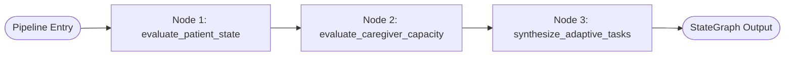

# CareCircle AI — "One Adaptive Team"

> **An intelligent, multimodal healthcare platform synchronizing Patients, Caregivers, and AI Co-Pilots into one collaborative care network.**

[](https://react.dev/)
[](https://fastapi.tiangolo.com/)
[](https://expressjs.com/)
[](https://www.mongodb.com/)
[](https://cloud.google.com/vertex-ai)
[](https://langchain-ai.github.io/langgraph/)
[](https://socket.io/)
[](https://tailwindcss.com/)

---

## 1. Executive Summary & Vision

In traditional healthcare management, patients and family caregivers operate in isolation:
- Patients struggle with adherence, progressive mobility exercises, and unmonitored fatigue.
- Family caregivers experience chronic, invisible burnout, sleep deficits, and compassion fatigue.
- Physicians and circles lack dynamic day-to-day context between clinical visits.

**CareCircle AI** solves this by establishing **One Adaptive Team**:
1. **Multimodal Biometric Vision**: Evaluates patient resting composure, facial tension, and fatigue via non-intrusive 10-second camera check-ins.
2. **AI Medication Verification**: Inspects pill blisters and prescription packaging via multimodal computer vision to ensure verified adherence rather than manual honor-system clicks.
3. **Caregiver Resilience Telemetry**: Monitors caregiver emotional load, sleep deficits, and active circle burdens, enforcing mandatory respite quotas.
4. **LangGraph Adaptive Planner**: A multi-agent StateGraph dynamically synthesizing daily care schedules for both Patient and Caregiver based on live biometrics, condition modules (Stroke, Diabetes, Hypertension), and caregiver load capacity.
5. **Context-Aware Co-Pilot**: An AI clinical assistant powered by Gemini 2.5 Flash on Vertex AI with dynamic circle memory injection.

---

## 2. High-Level Architectural Topology

```mermaid
flowchart TB
    subgraph Client Application [Client Layer: React 19 + TypeScript + Vite]
        UI_SIDEBAR[Desktop Sidebar Navigation]
        UI_FLOAT[Mobile Glassmorphic Auto-Hiding Floating Bar]
        UI_POPOVER[Top Navbar Real-Time Alert Popover]
        UI_PAGES[Pages: Circle | Medications | Care Plan | AI Co-Pilot | Wellness Check-in | Alerts Center | Caregiver Resilience]
        UI_REACT_QUERY[TanStack Query Cache & Polling]
    end

    subgraph Gateway Layer [Express.js Core Gateway : Port 5000]
        AUTH_GUARD[JWT Auth & Circle Context Guard Middleware]
        REST_ROUTES[Modular REST Endpoints: /api/circles, /api/medications, /api/tasks, /api/monitoring, /api/alerts, /api/chat]
        SOCKET_HUB[Socket.io Real-Time Room Dispatcher]
        MONGO_ORM[Mongoose ODM with Compound Indexing]
    end

    subgraph Data Persistence [MongoDB Database : Port 27017]
        COL_USERS[(users)]
        COL_CIRCLES[(care_circles)]
        COL_MEDS[(medications & medication_logs)]
        COL_PLANS[(plans_and_tasks)]
        COL_MON[(monitoring_records)]
        COL_ALERTS[(alerts)]
        COL_CHAT[(chat_messages)]
    end

    subgraph Intelligence Microservice [FastAPI Service : Port 8000]
        F_ROUTERS[FastAPI Modular Routers: /chat, /analyze/monitoring, /analyze/medication-photo, /analyze/caregiver-burnout, /plan/generate]
        LANGGRAPH_ENGINE[LangGraph StateGraph Multi-Agent Planner]
        GENAI_SDK[Google GenAI SDK: google.genai]
    end

    subgraph Foundation Models [Google Cloud Vertex AI]
        GEMINI[Gemini 2.5 Flash: Multimodal Vision & Reasoning]
    end

    Client Application <-->|HTTPS REST & WebSockets| Gateway Layer
    Gateway Layer <-->|Mongoose TCP| Data Persistence
    Gateway Layer <-->|Internal Async HTTP RPC| Intelligence Microservice
    Intelligence Microservice <-->|gRPC / Vertex AI REST API| GEMINI
```

---

## 3. Low-Level System Design & Engineering Architecture

### 3.1 Inter-Service Communication & Flow
- **Gateway Pattern**: The Express application acts as the single public-facing API Gateway and security perimeter. All authentication, rate limiting, MongoDB transactions, and audit logs are handled here.
- **AI Microservice RPC**: Express dispatches heavy AI, computer vision, and multi-agent operations to the FastAPI microservice over internal HTTP with strict timeout budgets (12–15s).
- **Graceful Algorithmic Fallbacks**: If the AI microservice or cloud network experiences transient timeouts, both Express and FastAPI employ deterministic clinical fallback algorithms, ensuring zero application downtime.

### 3.2 Real-Time Event-Driven Architecture (Socket.io)
Connected clients join an isolated room: `care-circle:{careCircleId}`.
```
┌─────────────────────────────────┬─────────────────┬────────────────────────────────────────┐
│ Event Name                      │ Direction       │ Trigger & Payload                      │
├─────────────────────────────────┼─────────────────┼────────────────────────────────────────┤
│ join-circle                     │ Client → Server │ { careCircleId }                       │
│ monitoring:new                  │ Server → Client │ New MonitoringRecord (biometrics/load) │
│ alert:new                       │ Server → Client │ New Alert object (high stress/missed)  │
│ plan:updated                    │ Server → Client │ Updated PlanAndTask object             │
│ medication:updated              │ Server → Client │ Updated MedicationLog adherence entry  │
│ chat:message                    │ Both            │ ChatMessage object                     │
└─────────────────────────────────┴─────────────────┴────────────────────────────────────────┘
```

### 3.3 Security, Privacy & Consent Guardrails
- **JWT Authorization**: All private routes validate a JSON Web Token containing `userId`, `role`, and `email`.
- **Care Circle Guard (`careCircleGuard`)**: Verifies that the authenticated user is an active member of the target circle before exposing biometric telemetry or medical records.
- **Biometric Ephemerality**: In-browser camera snapshots are converted to memory buffers (`Multer.memoryStorage()`) and sent directly to Gemini Vision via binary byte streams without storing unencrypted raw user face images on local disk.

---

## 4. Deep-Dive Database Schemas (MongoDB / Mongoose)

The persistence layer consists of 8 collections in MongoDB, indexed for high-concurrency circle access:

### 4.1 `users`
Represents patients and caregivers.
```typescript
{
  _id: ObjectId,
  fullName: string,
  email: string,              // unique, lowercase index
  password: string,           // bcrypt hash (salt factor 10)
  role: 'patient' | 'caregiver',
  avatar: string,
  conditions: string[],       // e.g. ["stroke", "diabetes", "hypertension"]
  emergencyContacts: [{ name: string, phone: string, relationship: string }],
  createdAt: Date,
  updatedAt: Date
}
```

### 4.2 `care_circles`
Binds patients with primary and secondary caregivers.
```typescript
{
  _id: ObjectId,
  patientId: ObjectId,        // ref: 'User' (index)
  name: string,               // e.g. "Rahul's Care Circle"
  inviteCode: string,         // unique index (e.g. "CARE-A1B2")
  members: [{
    userId: ObjectId,         // ref: 'User'
    roleInCircle: 'primary_caregiver' | 'secondary' | 'family',
    permissions: string[],    // ["view_monitoring", "receive_alerts", "edit_plans"]
    joinedAt: Date
  }],
  status: 'active' | 'archived',
  createdAt: Date,
  updatedAt: Date
}
// Compound Index: { patientId: 1, 'members.userId': 1 }
```

### 4.3 `medications` & `medication_logs`
- **`medications`**: Prescriptions catalog with dosage, frequency (`once_daily`, `twice_daily`, `custom`), times (`["08:00", "20:00"]`), and instructions.
- **`medication_logs`**: Scheduled dosage entries indexed by `medicationId + scheduledTime`:
```typescript
{
  _id: ObjectId,
  medicationId: ObjectId,     // ref: 'Medication' (index)
  careCircleId: ObjectId,     // ref: 'CareCircle' (index)
  patientId: ObjectId,        // ref: 'User'
  scheduledTime: Date,        // target slot (e.g. 2026-09-27T08:00:00Z)
  status: 'pending' | 'taken' | 'missed' | 'skipped',
  confirmedAt: Date,
  confirmationMethod: 'manual' | 'photo' | 'voice',
  photoUrl: string,
  aiVerification: {
    isMatch: boolean,
    confidence: number,       // 0.0 to 1.0
    notes: string,
    detectedDetails: string
  },
  notes: string,
  loggedBy: ObjectId
}
```

### 4.4 `monitoring_records`
Stores biometric facial checks and caregiver load assessments:
```typescript
{
  _id: ObjectId,
  careCircleId: ObjectId,     // ref: 'CareCircle' (index)
  userId: ObjectId,           // ref: 'User' (index)
  type: 'patient_stress' | 'patient_fatigue' | 'caregiver_burnout' | 'patient_vitals',
  source: 'camera' | 'manual' | 'wearable_sim',
  data: {
    stressScore: number,      // 0-100
    fatigueScore: number,     // 0-100
    burnoutScore?: number,    // 0-100 (for caregiver_burnout)
    capacityLevel?: string,   // 'optimal' | 'moderate' | 'pacing_needed' | 'burnout_risk'
    mood: string,             // 'Calm', 'Alert', 'Exhausted', etc.
    expressionSummary: string,
    recommendation: string,
    suggestedActions?: string[],
    confidence: number,
    rawAnalysis: object
  },
  timestamp: Date,
  processedAt: Date
}
// Compound Index: { careCircleId: 1, timestamp: -1 }
```

### 4.5 `alerts`
Consolidated notifications and safety warnings:
```typescript
{
  _id: ObjectId,
  careCircleId: ObjectId,     // ref: 'CareCircle' (index)
  triggeredFor: ObjectId,     // ref: 'User'
  severity: 'low' | 'medium' | 'high' | 'emergency',
  type: 'high_stress' | 'high_fatigue' | 'missed_med' | 'photo_unverified' | 'caregiver_burnout' | 'custom',
  title: string,
  message: string,
  dataSnapshot: object,       // e.g. { stressScore: 78, confidence: 0.45 }
  status: 'new' | 'acknowledged' | 'resolved' | 'dismissed',
  suggestedActions: [{ label: string, actionType: string, param?: string }],
  acknowledgedBy: ObjectId,
  acknowledgedAt: Date,
  resolvedBy: ObjectId,
  resolvedAt: Date,
  createdAt: Date
}
// Compound Index: { careCircleId: 1, status: 1, createdAt: -1 }
```

### 4.6 `plans_and_tasks`
Daily synchronized routines generated by the LangGraph agent:
```typescript
{
  _id: ObjectId,
  careCircleId: ObjectId,     // ref: 'CareCircle' (index)
  date: Date,                 // start of day (00:00:00 UTC)
  type: 'daily' | 'weekly',
  patientTasks: [{
    id: string,               // e.g. "pt-1"
    title: string,
    description: string,
    category: 'rehab' | 'medication' | 'exercise' | 'rest' | 'checkin',
    status: 'pending' | 'completed' | 'skipped',
    completedAt: Date,
    estimatedMinutes: number
  }],
  caregiverTasks: [{
    id: string,               // e.g. "ct-1"
    title: string,
    description: string,
    category: 'support' | 'monitoring' | 'self_care' | 'coordination',
    status: 'pending' | 'completed' | 'skipped',
    completedAt: Date,
    estimatedMinutes: number
  }],
  generatedBy: 'ai' | 'manual',
  aiReasoning: string,        // transparent explanation of clinical calibration
  patientEnergyLevel: string, // e.g. "High (Active Rehabilitation)"
  caregiverCapacity: string,  // e.g. "Medium (Balanced Routine)"
  createdAt: Date,
  updatedAt: Date
}
```

---

## 5. Multi-Agent Intelligence Core & LangGraph Planner

The AI microservice (`fastapi/app/services/plan_agent.py`) implements a sequential 3-node **LangGraph StateGraph** pipeline:



### 5.1 LangGraph State Definition
```python
class PlannerGraphState(TypedDict, total=False):
    # Inputs
    caregiver_name: str
    patient_name: str
    patient_conditions: List[str]
    patient_stress_score: int
    patient_fatigue_score: int
    patient_mood: str
    caregiver_burnout_score: int
    caregiver_capacity_level: str
    caregiver_sleep_quality: str
    recent_adherence_rate: int
    active_alerts_count: int

    # Intermediate Evaluated Nodes
    patient_posture: str          # "restorative" | "balanced" | "active_rehabilitation"
    patient_energy_level: str
    caregiver_allowance: str      # "minimal_respite" | "balanced_support" | "full_engagement"
    caregiver_capacity: str
    focus_themes: List[str]

    # Final Output
    ai_reasoning: str
    patient_tasks: List[Dict[str, Any]]
    caregiver_tasks: List[Dict[str, Any]]
    graph_metadata: Dict[str, Any]
```

### 5.2 Node Execution Details
1. **`evaluate_patient_state`**:
   - Assesses patient fatigue, stress, adherence rate, and condition tags (e.g. `stroke` $\rightarrow$ `stroke_rehab`, `diabetes` $\rightarrow$ `glycemic_control`).
   - If `fatigue >= 60` or `stress >= 65` $\rightarrow$ Posture is **`restorative`** (prescribing diaphragmatic breathing, hydration, and low-exertion recovery).
   - If `fatigue <= 35` and `stress <= 40` $\rightarrow$ Posture is **`active_rehabilitation`** (prescribing progressive mobility, bilateral arm exercises, and endurance walking).
2. **`evaluate_caregiver_capacity`**:
   - Evaluates caregiver burnout score, sleep deficit, and active circle alerts.
   - If `burnout >= 70` or `sleep == 'poor'` $\rightarrow$ Allowance is **`minimal_respite`**: strictly limits support tasks to 1-2 essential checks and **injects a mandatory 20-minute self-care respite task**.
   - If `burnout < 40` $\rightarrow$ Allowance is **`full_engagement`** (balanced support across nutrition, coordination, and therapy assistance).
3. **`synthesize_adaptive_tasks`**:
   - Calls **Gemini 2.5 Flash on Vertex AI** with the combined clinical constraints, enforcing strict JSON output conforming to the `AdaptiveTaskItem` schema.
   - Generates transparent `aiReasoning` explaining to the family *why* today's routine was calibrated the way it was.

---

## 6. Multimodal Computer Vision Pipelines

### 6.1 Facial Wellness Check-in (`POST /analyze/monitoring`)
- **Technology**: In-browser canvas capture $\rightarrow$ Base64/JPEG byte stream $\rightarrow$ Gemini 2.5 Flash Multimodal Vision (`types.Part.from_bytes`).
- **Prompt Logic**: Analyzes resting facial tension (forehead furrowing, jaw clenching), eye openness and heaviness, and resting posture.
- **Output**: JSON containing `stressScore` (0-100), `fatigueScore` (0-100), `mood`, `expressionSummary`, and recovery advice.
- **Automated Escalation**: If `stressScore > 70` or `fatigueScore > 75`, Express automatically triggers a `high_stress` or `high_fatigue` Alert.

### 6.2 Medication Photo Verification (`POST /analyze/medication-photo`)
- **Technology**: Camera snapshot of medication blister packs, pill bottles, or pills.
- **Prompt Logic**: Compares the visual features in the image against the target medicine name, dosage instructions, and packaging markers.
- **Output**: JSON containing `isTaken` (boolean), `confidence` (0.0 to 1.0), `detectedDetails`, and clinical advice.
- **Adherence Validation**: If confidence $< 0.60$ or no medication packaging is visible, an alert is triggered in the circle for caregiver follow-up.

---

## 7. API Reference Matrix

### 7.1 Express Gateway Endpoints (`http://localhost:5000`)

| Route | Method | Access | Purpose |
| :--- | :--- | :--- | :--- |
| `/api/auth/register` | `POST` | Public | Register new patient or caregiver |
| `/api/auth/login` | `POST` | Public | Authenticate user & return JWT token |
| `/api/auth/me` | `GET` | Private | Retrieve authenticated user profile |
| `/api/circles/current` | `GET` | Private | Retrieve active Care Circle, members, and condition tags |
| `/api/circles/join` | `POST` | Private | Link caregiver to patient circle via invite code |
| `/api/medications` | `GET` | Private | Retrieve medication catalog and today's schedule |
| `/api/medications` | `POST` | Private | Create new medication prescription |
| `/api/medications/:id/log` | `POST` | Private | Manually log dose adherence (taken/skipped) |
| `/api/medications/:id/confirm-photo` | `POST` | Private | Upload photo for multimodal adherence verification |
| `/api/tasks/today` | `GET` | Private | Retrieve today's dual-role plan and metrics |
| `/api/tasks/:team/:taskId` | `PATCH` | Private | Toggle task completion status |
| `/api/tasks` | `POST` | Private | Add custom task to patient or caregiver track |
| `/api/tasks/generate` | `POST` | Private | Invoke LangGraph agent to generate adaptive daily plan |
| `/api/monitoring/analyze` | `POST` | Private | Upload facial check-in photo for biometric evaluation |
| `/api/monitoring/caregiver-burnout` | `POST` | Private | Log caregiver load signals and calculate burnout score |
| `/api/monitoring/caregiver-burnout/latest`| `GET` | Private | Fetch latest caregiver capacity and respite guidance |
| `/api/monitoring/caregiver-burnout/nudge` | `POST` | Private | Proactively send circle respite backup request |
| `/api/alerts` | `GET` | Private | Retrieve active and historical circle alerts |
| `/api/alerts/:id/acknowledge` | `PATCH` | Private | Acknowledge active alert |
| `/api/alerts/:id/resolve` | `PATCH` | Private | Resolve alert |
| `/api/chat/history` | `GET` | Private | Retrieve recent conversation turns |
| `/api/chat/message` | `POST` | Private | Send prompt to AI Co-Pilot with circle context |

### 7.2 FastAPI Microservice Endpoints (`http://localhost:8000`)

| Route | Method | Request Payload | Output |
| :--- | :--- | :--- | :--- |
| `/health` | `GET` | None | `{ status: "ok", service: "fastapi" }` |
| `/chat` | `POST` | `ChatRequest` (message, roleContext, contextData) | `ChatResponse` (AI Co-Pilot advice) |
| `/analyze/monitoring` | `POST` | Multipart Form: image file, role, patientName | `MonitoringAnalysisResponse` (stress, fatigue, mood) |
| `/analyze/medication-photo`| `POST` | Multipart Form: image file, medicationName, dosage | `MedicationVerificationResponse` (isTaken, confidence) |
| `/analyze/caregiver-burnout`| `POST` | `CaregiverBurnoutRequest` (sleep, fatigue, active alerts) | `CaregiverBurnoutResponse` (burnoutScore, respite) |
| `/plan/generate` | `POST` | `PlanGenerateRequest` (biometrics, burnout, conditions) | `PlanGenerateResponse` (LangGraph synthesized plan) |

---

## 8. Frontend Architecture & User Experience

Built on **React 19**, **TypeScript**, and **Tailwind CSS**:

- **Custom State & Hooks Architecture**:
  - `useAuth`: Manages JWT persistence, user profile, and active circle context in Redux / LocalStorage.
  - `useCircle`: Real-time circle member query and invitation actions.
  - `useMedications`: Daily adherence schedule, dosage check-offs, and photo verification modal.
  - `useTasks`: Task progress calculation and LangGraph adaptive plan generation mutation.
  - `useMonitoring`: Facial check-in webcam capture and timeline history.
  - `useCaregiverBurnout`: Live burnout gauge, capacity ratings, and circle respite nudges.
  - `useAlerts`: Background polling (every 8s) and notification badge management.
  - `useChat`: Real-time conversation streaming and context injection.
- **Modern Responsive Navigation**:
  - **Desktop Sidebar** ([`Sidebar.tsx`](file:///home/ubuntu/Hack/First/frontend/src/components/navigation/Sidebar.tsx)): Sticky desktop navigation with a live dynamic Caregiver Load meter in the footer.
  - **Top Navbar** ([`TopNavbar.tsx`](file:///home/ubuntu/Hack/First/frontend/src/components/navigation/TopNavbar.tsx)): Features the [`NotificationDropdown.tsx`](file:///home/ubuntu/Hack/First/frontend/src/components/navigation/NotificationDropdown.tsx) with live pulsing alert badge and quick-acknowledge capabilities.
  - **Floating Mobile Dock** ([`BottomNav.tsx`](file:///home/ubuntu/Hack/First/frontend/src/components/navigation/BottomNav.tsx)): Glassmorphic pill (`backdrop-blur-xl`, `rounded-2xl`, `shadow-2xl`) featuring smart scroll detection that slides out of view on scroll down and reappears on scroll up.

---

## 9. Local Setup & Quickstart Guide

### 9.1 Prerequisites
- **Node.js**: v18.0 or higher
- **Python**: v3.11 or higher
- **MongoDB**: Running locally on port `27017` (or MongoDB Atlas URI)
- **Google Cloud Platform**: Vertex AI enabled project (`geometric-team-457805-j0`)

### 9.2 Environment Configurations

#### Express Gateway (`backend/.env`):
```env
PORT=5000
MONGODB_URI=mongodb://localhost:27017/carecircle
JWT_SECRET=carecircle_super_secret_jwt_key_2026
FASTAPI_URL=http://localhost:8000
```

#### FastAPI Microservice (`fastapi/.env`):
```env
GOOGLE_CLOUD_PROJECT=geometric-team-457805-j0
GOOGLE_CLOUD_LOCATION=us-central1
FASTAPI_PORT=8000
```

#### Frontend Application (`frontend/.env`):
```env
VITE_API_URL=http://localhost:5000/api
```

---

### 9.3 Launching All Services

#### 1. Start MongoDB:
```bash
sudo systemctl start mongod
```

#### 2. Start Express Gateway:
```bash
cd backend
npm install
npm run dev
# Running on http://localhost:5000
```

#### 3. Start FastAPI AI Microservice:
```bash
cd fastapi
source venv/bin/activate
pip install -r requirements.txt
uvicorn main:app --host 0.0.0.0 --port 8000 --reload
# Running on http://localhost:8000 (Docs at /docs)
```

#### 4. Start React Frontend:
```bash
cd frontend
npm install
npm run dev
# Running on http://localhost:5173
```

---

## 10. Repository Directory Structure

```
First/
├── backend/
│   ├── server.js                        # Express server entry point & Socket.io hub
│   ├── package.json
│   └── src/
│       ├── config/                      # MongoDB database connection
│       ├── middleware/                  # JWT auth & careCircleGuard middlewares
│       ├── models/                      # 8 Mongoose domain models
│       └── routes/                      # Modular Express route handlers
├── fastapi/
│   ├── main.py                          # FastAPI ASGI application & router mounting
│   ├── requirements.txt                 # Pinned production Python dependencies
│   └── app/
│       ├── config.py                    # GCP project & Vertex AI settings
│       ├── routers/                     # APIRouters: copilot, monitoring, medication, plan
│       ├── schemas/                     # Pydantic request & response validation schemas
│       └── services/                    # LangGraph StateGraph agent, Gemini vision services
├── frontend/
│   ├── index.html
│   ├── vite.config.ts
│   └── src/
│       ├── App.tsx                      # Client router & query client providers
│       ├── components/                  # UI components (shadcn/ui, tasks, meds, alerts, nav)
│       ├── hooks/                       # Custom domain hooks (useTasks, useAlerts, useChat, etc.)
│       ├── lib/                         # Typed API client & Axios/fetch abstraction
│       ├── pages/                       # Application screens (Circle, Plan, Chat, Alerts, Burnout)
│       └── store/                       # Redux store for user auth session
└── README.md                            # Comprehensive system documentation
```

---

## 11. Testing & Verification

- **Frontend Compilation**: Production build passes with zero TypeScript warnings:
  ```bash
  npm --prefix frontend run build
  # tsc -b && vite build -> built in ~600ms (0 errors)
  ```
- **Microservice Dependency Check**: Verified with pip:
  ```bash
  /home/ubuntu/Hack/First/fastapi/venv/bin/pip check
  # Output: No broken requirements found.
  ```
- **AI End-to-End Validation**:
  - Live facial check-in biometric analysis verified with Gemini 2.5 Flash Multimodal Vision.
  - Medication photo confirmation tested with packaging detection and confidence scoring.
  - LangGraph 3-node multi-agent planner tested with dynamic patient recovery and caregiver respite quotas.
